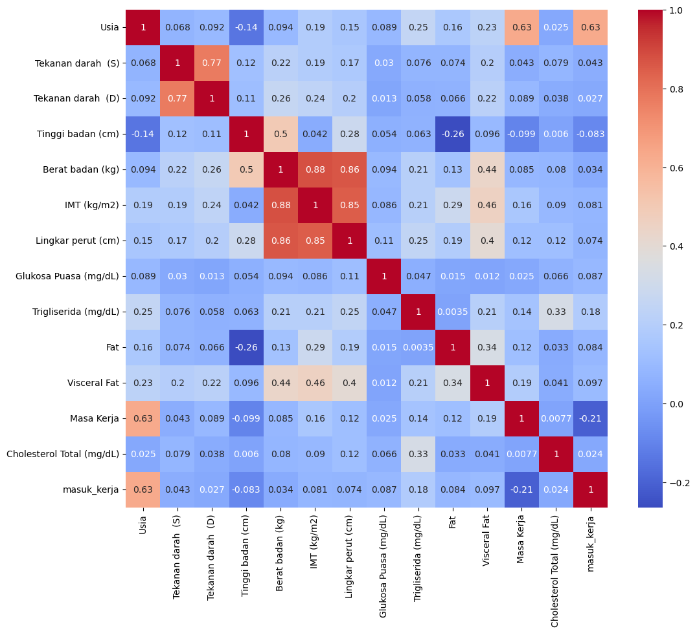
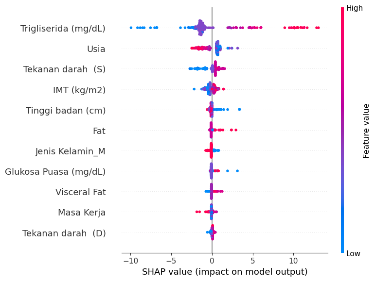

# cholesterol-prediction-regression

## Domain Proyek

### Latar Belakang
Kesehatan karyawan merupakan aset penting yang secara langsung memengaruhi produktivitas dan keberlanjutan perusahaan. Salah satu indikator penting dalam menilai kondisi kesehatan adalah kadar kolesterol total dalam darah. Kadar kolesterol yang melebihi batas normal diketahui berhubungan dengan peningkatan risiko berbagai penyakit kronis, termasuk penyakit jantung koroner dan stroke.

Dalam konteks pencegahan dan pengelolaan kesehatan, pemahaman terhadap faktor-faktor yang memengaruhi kadar kolesterol menjadi sangat krusial. Analisis prediktif menggunakan teknik machine learning dapat menjadi alat bantu yang efektif dalam mengidentifikasi pola dan hubungan antar variabel kesehatan yang kompleks.

Melalui proyek ini, dilakukan pendekatan prediktif untuk memperkirakan kadar kolesterol total berdasarkan sejumlah fitur kesehatan seperti usia, indeks massa tubuh (IMT), lingkar perut, tekanan darah, dan kadar trigliserida. Hasil dari proyek ini diharapkan dapat mendukung upaya deteksi dini dan perencanaan intervensi yang lebih tepat sasaran bagi karyawan dengan risiko tinggi.

## Business Understanding

### Problem Statement
Berdasarkan pada latar belakang yang telah dijelaskan, permasalahan yang ingin diselesaikan dalam proyek ini adalah sebagai berikut:
* Bagaimana cara membangun model yang mampu memprediksi kadar kolesterol total hanya berdasarkan data kesehatan sederhana tanpa pemeriksaan laboratorium lengkap?
* Bagaimana mengidentifikasi fitur-fitur kesehatan yang paling berpengaruh terhadap kadar kolesterol untuk mendukung interpretasi hasil model secara medis?
* Bagaimana memilih dan mengoptimalkan algoritma machine learning yang memberikan performa terbaik dalam memprediksi kadar kolesterol total?
* Bagaimana menyederhanakan model agar tetap akurat namun lebih efisien dan praktis digunakan untuk skrining awal di lingkungan kerja?

### Goals
Tujuan proyek ini dibuat adalah sebagai berikut :
* Membangun model prediktif untuk memperkirakan kadar kolesterol total berdasarkan data kesehatan yang tersedia.
* Mengidentifikasi fitur-fitur kesehatan paling berpengaruh terhadap kadar kolesterol menggunakan analisis interpretabilitas model (SHAP).
* Membandingkan performa berbagai algoritma machine learning seperti Random Forest, XGBoost, dan Linear Regression untuk memilih model terbaik.
* Menghasilkan model yang cukup akurat dan efisien sehingga dapat digunakan sebagai alat bantu deteksi dini risiko kolesterol tinggi tanpa harus melakukan pemeriksaan laboratorium lengkap.

### Solution Statement
Solusi yang dapat dilakukan agar goals terpenuhi adalah sebagai berikut :
* Melakukan eksplorasi dan pembersihan data untuk memastikan kualitas data yang digunakan dalam pemodelan.
* Melatih dan mengevaluasi berbagai model regresi, seperti Linear Regression, Lasso, Random Forest, dan XGBoost, untuk memprediksi kadar kolesterol total.
* Melakukan tuning hyperparameter pada model terpilih guna meningkatkan performa prediksi.
* Menggunakan analisis SHAP untuk mengidentifikasi fitur-fitur yang paling berpengaruh terhadap output model.
* Menyederhanakan model dengan memilih subset fitur terbaik berdasarkan hasil SHAP untuk meningkatkan efisiensi tanpa mengorbankan akurasi.

## Data Understanding
Dataset yang digunakan pada proyek ini diambil dari kompetisi yang diadakan di website kaggle [Cholesterol Prediction](https://www.kaggle.com/competitions/ndsc-regression-cholesterol-prediction/data). Data ini terdiri dari 1071 baris dan 15 fitur dan disimpan dalam format csv. Berikut penjelasan dari setiap kolom.
* Jenis Kelamin - Jenis kelamin karyawan (misalnya, 'M' untuk Laki-laki, 'F' untuk Perempuan).
* Usia - Usia karyawan dalam tahun.
* Tekanan darah (S) - Tekanan darah sistolik karyawan, yaitu angka atas dalam pengukuran tekanan darah (misalnya, dalam mmHg).
* Tekanan darah (D) - Tekanan darah diastolik karyawan, yaitu angka bawah dalam pengukuran tekanan darah (misalnya, dalam mmHg).
* Tinggi badan (cm) - Tinggi badan karyawan dalam sentimeter.
* Berat badan (kg) - Berat badan karyawan dalam kilogram.
* IMT (kg/m2) - Indeks Massa Tubuh (Body Mass Index) karyawan, dihitung sebagai berat badan (kg) dibagi kuadrat tinggi badan (m).
* Lingkar perut (cm) - Ukuran lingkar perut karyawan dalam sentimeter.
* Glukosa Puasa (mg/dL) - Kadar glukosa darah karyawan setelah berpuasa, diukur dalam miligram per desiliter.
* Cholesterol Total (mg/dL) - Kadar kolesterol total dalam darah karyawan, diukur dalam miligram per desiliter. Ini adalah variabel target untuk tugas regresi Anda.
* Trigliserida (mg/dL) - Kadar trigliserida dalam darah karyawan, diukur dalam miligram per desiliter.
* Fat - Persentase lemak tubuh karyawan.
* Visceral Fat - Tingkat lemak viseral (lemak di sekitar organ dalam perut) karyawan.
* Masa Kerja - Lama waktu karyawan telah bekerja, dalam tahun.
* Tempat lahir - Tempat atau kota kelahiran karyawan.

### Exploratory Data Analysis
Sebelum melakukan pemrosesan data, ada baiknya untuk mengeksplor data untuk mengetahui keadaan data seperti mencari korelasi antar fitur, mencari outlier, analisis univariate dan multivariate
* Univariate Analysis pada tahap ini berfungsi untuk mencari tahu mengenai distribusi data.

    

    Gambar di atas merupakan persebaran data numerik. Dapat dilihat pada gambar di atas, sebagian besar fitur dalam dataset memiliki distribusi yang mendekati normal, seperti usia, tinggi badan, berat badan, dan IMT. Namun, beberapa fitur seperti glukosa puasa, trigliserida, visceral fat, dan fat menunjukkan distribusi yang sangat skewed ke kanan, dengan dominasi nilai rendah dan sebagian kecil nilai ekstrem. Untuk mengatasi hal ini dan meningkatkan performa model, keempat fitur tersebut direncanakan untuk dilakukan transformasi log guna menstabilkan varians dan memperbaiki distribusi data.

    
    
    Sedangkan pada data numerik, yaitu Jenis Kelamin memiliki data yang tidak seimbang. Jumlah laki-laki(M) lebih banyak dibandingkan jumlah wanita(F). Sedangkan untuk fitur Tempat Lahir dihapus karena terlalu banyak kategori yang mampu memengaruhi model dan tidak terlalu berdampak pada target.

* Analisis multivariat pada tahap ini dilakukan untuk memahami hubungan antar fitur dalam dataset, baik antara sesama fitur independen maupun antara fitur dengan target, guna mengidentifikasi korelasi, multikolinearitas, atau pola hubungan yang relevan untuk pemodelan.

    Untuk fitur Jenis Kelamin, baik laki-laki maupun perempuan memiliki rata-rata kadar kolesterol total yang hampir sama, yaitu sebesar 190.65 mg/dL untuk perempuan dan 187.82 mg/dL untuk laki-laki. Hal ini menunjukkan bahwa jenis kelamin tidak memberikan perbedaan yang signifikan terhadap nilai target dalam dataset ini.

    

    Berdasarkan visualisasi heatmap korelasi, fitur Trigliserida memiliki korelasi moderat dengan target dan dapat diprioritaskan dalam pemodelan. Sebagian besar fitur lain menunjukkan korelasi yang lemah hingga sangat lemah, sehingga efektivitasnya perlu diuji lebih lanjut melalui modeling. Analisis juga menunjukkan adanya potensi multikolinearitas, seperti hubungan kuat antara tekanan darah sistolik dan diastolik (r = 0.77), serta korelasi sangat kuat antara berat badan, IMT, dan lingkar perut (r > 0.8), yang semuanya merepresentasikan status kelebihan berat badan dan berisiko menyebabkan redudansi informasi dalam model regresi.

## Data Preparation

### Menghapus kolom atau fitur yang kurang relevan
Terdapat kolom yang kurang relevan seperti "Tempat lahir" dan "masuk_kerja", karena kolom tersebut tidak memiliki hubungan langsung dengan prediksi kadar kolesterol dan cenderung bersifat administratif atau tidak informatif secara statistik. Oleh karena itu, kolom-kolom ini dihapus agar dataset menjadi lebih bersih, fokus pada fitur-fitur yang relevan, dan menghindari gangguan terhadap performa model.

### Data splitting
Data dibagi menjadi tiga yaitu train, validasi, dan test. Data train digunakan untuk melatih model awal. Data validasi digunakan untuk evaluasi awal dari 4 model. Dari ketiga model dipilih yang terbaik dan dilakukan hyperparameter tuning. Sedangkan data test digunakan evaluasi akhir model terbaik yang terpilih.

### Log Transform
Log Transform digunakan untuk mengubah distribusi data yang sangat miring (skewed) agar mendekati distribusi normal. Ini membantu meningkatkan performa model terutama pada algoritma yang sensitif terhadap distribusi data (seperti regresi linear). Biasanya diterapkan pada variabel numerik dengan sebaran sangat tidak simetris.

### One-Hot Encoding
One-Hot Encoding adalah teknik untuk mengubah variabel kategori menjadi format numerik yang bisa digunakan model machine learning. Setiap kategori diubah menjadi kolom biner (0 atau 1). Metode ini mencegah model menganggap adanya urutan atau jarak antara kategori.

### Standarisasi
Standarisasi (Standardization) adalah proses mengubah skala fitur numerik agar memiliki mean = 0 dan standard deviation = 1. Ini penting terutama untuk algoritma yang mengandalkan perhitungan jarak (seperti SVM atau KNN), supaya semua fitur memiliki bobot yang seimbang.

### Seleksi Fitur
Dalam proyek ini, dilakukan **tiga eksperimen data** yang dirancang untuk mengevaluasi pengaruh pemilihan fitur dan teknik transformasi terhadap performa model dalam memprediksi kadar kolesterol total. Setiap eksperimen menerapkan pendekatan berbeda untuk memastikan perbandingan yang adil dan menyeluruh terhadap efektivitas fitur.

#### Eksperimen 1: Semua Fitur Asli

Eksperimen pertama menggunakan seluruh fitur numerik dan kategorikal yang tersedia dalam dataset, tanpa melakukan seleksi fitur atau menghapus fitur yang berkorelasi tinggi. Pendekatan ini bertujuan untuk menjadi baseline awal yang merepresentasikan performa model terhadap data mentah, sekaligus melihat bagaimana model menangani kompleksitas dan potensi multikolinearitas secara langsung.

#### Eksperimen 2: Fitur Terpilih (Tanpa Multikolinearitas)

Pada eksperimen kedua, dilakukan seleksi fitur dengan cara menghapus fitur-fitur yang memiliki korelasi sangat tinggi satu sama lain (nilai korelasi > 0.8), seperti **berat badan**, **lingkar perut**, dan **IMT**. Ketiga fitur ini saling berkorelasi kuat karena merepresentasikan aspek tubuh yang serupa. Untuk menghindari redundansi informasi dan potensi bias pada model, hanya satu fitur yang dipertahankan, yaitu **IMT**, karena secara klinis paling representatif dalam menilai proporsi tubuh terhadap tinggi badan. Pendekatan ini bertujuan untuk menyederhanakan struktur input model dan meningkatkan kemampuan generalisasi.

#### Eksperimen 3: Reduksi Dimensi dengan PCA

Eksperimen ketiga menerapkan teknik **Principal Component Analysis (PCA)** untuk mereduksi dimensi dari fitur-fitur yang saling berkorelasi tinggi. PCA digunakan pada tiga fitur utama: **berat badan**, **lingkar perut**, dan **IMT**, untuk mengubahnya menjadi komponen-komponen baru yang bebas multikolinearitas. Hasil analisis menunjukkan bahwa dua komponen utama pertama mampu menjelaskan sekitar **96% variasi total data** (*explained\_variance\_ratio\_: \[0.91, 0.051]*), sehingga digunakan sebagai fitur baru yang cukup representatif. Pendekatan ini tidak hanya menyederhanakan input, tetapi juga menjaga informasi penting dalam data serta meningkatkan efisiensi model tanpa mengorbankan akurasi secara signifikan.

Ketiga eksperimen ini akan dievaluasi menggunakan algoritma dan metrik evaluasi yang sama agar hasilnya dapat dibandingkan secara objektif dan konsisten.


## Modelling
Model yang digunakan dalam proyek ini bertujuan untuk memprediksi kadar kolesterol total berdasarkan fitur-fitur kesehatan karyawan. Untuk mendapatkan hasil yang optimal dan membandingkan efektivitas pendekatan yang berbeda, proyek ini mengimplementasikan tiga jenis eksperimen data serta menggunakan beberapa algoritma regresi.

### Algoritma yang Digunakan
Untuk masing-masing eksperimen, digunakan empat algoritma regresi

#### Random Forest Regressor
Random Forest adalah algoritma ensemble berbasis pohon keputusan yang membangun beberapa pohon regresi selama pelatihan dan menghasilkan rata-rata prediksi dari masing-masing pohon sebagai output akhir. Pendekatan ini membantu meningkatkan akurasi prediksi dan mengurangi overfitting. Untuk model ini, dilakukan tuning pada beberapa hyperparameter berikut:

* n_estimators: Jumlah pohon yang digunakan dalam hutan.
* max_depth: Kedalaman maksimum dari setiap pohon keputusan.
* max_features: Jumlah fitur maksimum yang dipertimbangkan saat membagi node.
* min_samples_split: Jumlah minimal sampel untuk membagi node internal.

##### Kelebihan 
* Tahan terhadap overfitting.
* Mampu menangani data dengan fitur numerik maupun kategorikal.
* Dapat menangani missing value dan outlier.

##### Kekurangan 
* Kurang dapat diinterpretasikan secara langsung
* Waktu komputasi relatif tinggi jika jumlah pohon besar

#### **XGBoost Regressor**
XGBoost (Extreme Gradient Boosting) adalah algoritma boosting yang sangat efisien dan akurat. Dibandingkan dengan model boosting tradisional, XGBoost dilengkapi berbagai optimasi untuk meningkatkan kecepatan dan kinerja. Model ini menggunakan pohon keputusan sebagai model dasar. Beberapa hyperparameter penting yang digunakan antara lain:
* n_estimators: Jumlah pohon yang digunakan.
* max_depth: Kedalaman maksimum dari setiap pohon.
* learning_rate: Menentukan seberapa besar kontribusi setiap pohon dalam pembelajaran.
* subsample: Persentase baris yang digunakan untuk membangun setiap pohon.
* colsample_bytree: Persentase kolom yang digunakan saat membangun pohon. 

##### Kelebihan 
* Sangat kuat untuk data non-linear dan kompleks.
* Dilengkapi dengan regularisasi untuk menghindari overfitting.
* Performa tinggi pada data besar.

##### Kekurangan 
* Proses tuning lebih kompleks dan sensitif terhadap parameter.
* Interpretasi model cukup sulit tanpa bantuan tools seperti SHAP.

#### **Linear Regression** 
Linear Regression merupakan model dasar dalam regresi yang mengasumsikan hubungan linear antara fitur dan target. Dalam proyek ini, model ini digunakan sebagai baseline tanpa melakukan tuning hyperparameter.

##### Kelebihan 
* Mudah dipahami dan diimplementasikan.
* Cocok untuk data dengan hubungan linear sederhana.
* Hasil mudah diinterpretasi.

##### Kekurangan 
* Tidak dapat menangkap hubungan non-linear.
* Sensitif terhadap multikolinearitas dan outlier.

#### **Lasso Regression** 
Lasso (Least Absolute Shrinkage and Selection Operator) adalah regresi linear dengan regularisasi L1, yang mampu mengurangi kompleksitas model dengan mengeliminasi beberapa fitur. Dalam proyek ini, model digunakan dengan default hyperparameters.

##### Kelebihan 
* Melakukan seleksi fitur otomatis.
* Mengurangi risiko overfitting.

##### Kekurangan 
* Tidak cocok untuk data dengan multikolinearitas tinggi.
* Sulit diinterpretasikan jika terlalu banyak fitur dieliminasi.

## Evaluasi

Untuk mengukur kinerja model regresi dalam memprediksi kadar kolesterol total, digunakan tiga metrik evaluasi utama, yaitu:

### 1. Mean Absolute Error (MAE)
MAE mengukur rata-rata selisih absolut antara nilai aktual dan nilai prediksi. Metrik ini mudah dipahami dan tidak terlalu sensitif terhadap outlier.

$$
\text{MAE} = \frac{1}{n} \sum_{i=1}^{n} \left| y_i - \hat{y}_i \right|
$$

Keterangan:

* $y_i$ : nilai aktual (true value) ke-$i$
* $\hat{y}_i$ : nilai prediksi ke-$i$
* $n$ : jumlah total sampel

Semakin kecil nilai MAE, semakin baik performa model.

---

### 2. Root Mean Squared Error (RMSE)
RMSE adalah akar dari rata-rata kuadrat selisih antara nilai aktual dan prediksi. Metrik ini memberi penalti lebih besar terhadap kesalahan prediksi yang besar, sehingga sensitif terhadap outlier.

$$
\text{RMSE} = \sqrt{ \frac{1}{n} \sum_{i=1}^{n} (y_i - \hat{y}_i)^2 }
$$

* $y_i$ : nilai aktual (true value) ke-$i$
* $\hat{y}_i$ : nilai prediksi ke-$i$
* $n$ : jumlah total sampel

- Cocok digunakan saat kesalahan besar perlu dihindari.
- Semakin rendah RMSE, semakin akurat model dalam memprediksi.

---

### 3. Coefficient of Determination (R² Score)
R² menunjukkan seberapa besar variansi dalam data target dapat dijelaskan oleh fitur input. Nilai R² berada antara \(-\infty\) hingga 1.

$$
R^2 = 1 - \frac{ \sum_{i=1}^{n} (y_i - \hat{y}_i)^2 }{ \sum_{i=1}^{n} (y_i - \bar{y})^2 }
$$

* $y_i$ : nilai aktual ke-$i$
* $\hat{y}_i$ : nilai prediksi ke-$i$
* $\bar{y}$ : rata-rata nilai aktual
* $n$ : jumlah total sampel

**Penjelasan:**

* $R^2 = 1$ → model menjelaskan **100% variansi** dari data target (prediksi sempurna)
* $R^2 = 0$ → model **tidak lebih baik** dari prediksi rata-rata (baseline)
* $R^2 < 0$ → model **lebih buruk** dari baseline, artinya model tidak berguna
* Semakin mendekati 1, semakin baik model dalam menjelaskan variasi pada data target

---

Ketiga metrik ini digunakan bersama untuk memberikan gambaran yang lebih menyeluruh terhadap performa model:

- **MAE** memberikan ukuran kesalahan rata-rata.
- **RMSE** menekankan kesalahan yang besar.
- **R²** mengukur kualitas model dalam menjelaskan variansi data.

### Eksperimen Data
#### **Eksperimen 1 – Semua Fitur Asli**

Hasil evaluasi pada data pelatihan dan data validasi dari eksperimen 1 ditampilkan dalam tabel berikut, berdasarkan metrik *Mean Absolute Error* (MAE), *Root Mean Squared Error* (RMSE), dan *R²*:

| Model                     | MAE   | RMSE  | R²      |
| ------------------------- | ----- | ----- | ------- |
| Random Forest (Train)     | 3.99  | 7.48  | 0.8745  |
| Random Forest (Test)      | 10.63 | 19.80 | -0.0140 |
| XGBoost (Train)           | 0.13  | 0.20  | 0.9999  |
| XGBoost (Test)            | 11.70 | 20.73 | -0.1108 |
| Linear Regression (Train) | 11.60 | 18.81 | 0.2057  |
| Linear Regression (Test)  | 11.09 | 18.28 | 0.1357  |
| Lasso (Train)             | 11.44 | 18.84 | 0.2036  |
| Lasso (Test)              | 10.89 | 18.18 | 0.1452  |

---

#### **Eksperimen 2 – Fitur Terpilih**

Hasil evaluasi performa model dari eksperimen 2 ditunjukkan sebagai berikut:

| Model                     | MAE   | RMSE  | R²      |
| ------------------------- | ----- | ----- | ------- |
| Random Forest (Train)     | 3.96  | 7.45  | 0.8754  |
| Random Forest (Test)      | 10.61 | 19.85 | -0.0185 |
| XGBoost (Train)           | 0.17  | 0.26  | 0.9998  |
| XGBoost (Test)            | 12.06 | 21.75 | -0.2228 |
| Linear Regression (Train) | 11.50 | 18.88 | 0.2002  |
| Linear Regression (Test)  | 10.87 | 18.13 | 0.1501  |
| Lasso (Train)             | 11.40 | 18.88 | 0.1997  |
| Lasso (Test)              | 10.83 | 18.12 | 0.1511  |

---

#### **Eksperimen 3 – Principal Component Analysis (PCA)**
Berikut hasil evaluasi model berdasarkan data pelatihan dan validasi dari ekperimen 3:

| Model                     | MAE   | RMSE  | R²      |
| ------------------------- | ----- | ----- | ------- |
| Random Forest (Train)     | 3.91  | 7.35  | 0.8789  |
| Random Forest (Test)      | 10.58 | 19.93 | -0.0273 |
| XGBoost (Train)           | 0.13  | 0.19  | 0.9999  |
| XGBoost (Test)            | 11.81 | 21.65 | -0.2116 |
| Linear Regression (Train) | 11.57 | 18.83 | 0.2043  |
| Linear Regression (Test)  | 10.98 | 18.23 | 0.1408  |
| Lasso (Train)             | 11.44 | 18.84 | 0.2036  |
| Lasso (Test)              | 10.89 | 18.19 | 0.1448  |

Berdasarkan evaluasi data validasi, Random Forest dan XGBoost menunjukkan indikasi overfitting di semua eksperimen, dengan R² tinggi pada data latih (> 0.86) namun sangat rendah pada data uji (< 0.01). Sebaliknya, Linear Regression dan Lasso Regression mengalami underfitting, ditunjukkan oleh R² yang rendah di kedua data (≈ 0.15), menandakan model terlalu sederhana.

Dari ketiga eksperimen, Eksperimen 2 direkomendasikan untuk tuning hyperparameter. Meski tetap terjadi overfitting, selisih performa train-test lebih kecil, dan R² pada data uji (-0.0185) paling mendekati nol dibanding eksperimen lainnya. Hal ini menunjukkan potensi generalisasi yang lebih baik sebagai titik awal untuk peningkatan model.Berdasarkan hasil tersebut, langkah selanjutnya adalah melakukan **tuning hyperparameter** pada model yang menunjukkan potensi performa lebih baik, seperti **Random Forest** dan **XGBoost**, untuk mengurangi overfitting dan meningkatkan generalisasi.

### Hyperparameter Tuning

Pada tahap ini dilakukan **tuning hyperparameter** untuk dua model yang menunjukkan potensi performa terbaik, yaitu **Random Forest** dan **XGBoost**. Proses tuning dilakukan menggunakan metode **GridSearchCV** pada data dari **Eksperimen 2**, yang sebelumnya dipilih karena memiliki keseimbangan performa terbaik antara data pelatihan dan validasi.

#### Parameter Grid

**Random Forest**:
```python
rf_params = {
    'n_estimators': [100, 200, 300],
    'max_depth': [5, 10, 20, None],
    'min_samples_split': [2, 5, 10],
    'max_features': ['auto', 'sqrt', 'log2']
}
```

**XGBoost**:
```python
xgb_params = {
    'n_estimators': [100, 200, 300],
    'max_depth': [3, 6, 10],
    'learning_rate': [0.01, 0.1, 0.2],
    'subsample': [0.7, 0.8, 1.0],
    'colsample_bytree': [0.7, 0.8, 1.0]
}
```

#### Parameter Terbaik

* **Random Forest**:
  `n_estimators=200`, `min_samples_split=2`, `max_features='sqrt'`, `max_depth=5`

* **XGBoost**:
  `n_estimators=100`, `max_depth=3`, `learning_rate=0.01`, `subsample=0.8`, `colsample_bytree=0.8`

Meeskipun kedua model menunjukkan nilai **MAE** yang sangat mirip, **XGBoost** memberikan hasil yang lebih baik dalam hal **RMSE** dan **R²**. Hal ini menunjukkan bahwa XGBoost mampu memberikan prediksi yang lebih stabil dan memiliki kemampuan generalisasi yang lebih baik terhadap data validasi.

Dengan mempertimbangkan seluruh metrik evaluasi setelah proses tuning, **XGBoost dipilih sebagai model akhir** untuk digunakan dalam tahap implementasi atau deployment proyek ini.

### Analisis SHAP
Untuk memahami kontribusi setiap fitur terhadap prediksi model, dilakukan analisis interpretabilitas menggunakan SHAP (SHapley Additive exPlanations). SHAP merupakan metode berbasis teori permainan yang memberikan nilai kontribusi setiap fitur terhadap output model, sehingga membantu menjelaskan mengapa sebuah prediksi dihasilkan.



Berdasarkan interpretasi SHAP, fitur Trigliserida, Usia, dan Indeks Massa Tubuh (IMT) secara konsisten memberikan kontribusi terbesar terhadap prediksi model. Nilai tinggi dari ketiga fitur tersebut cenderung menaikkan hasil prediksi, sejalan dengan pengetahuan medis yang menyatakan bahwa faktor-faktor tersebut berkaitan erat dengan peningkatan kadar kolesterol total.

Fitur Tekanan Darah Sistolik menunjukkan pengaruh sedang terhadap prediksi. Nilainya yang tinggi dapat meningkatkan prediksi model, meskipun dampaknya tidak sebesar tiga fitur utama di atas. Oleh karena itu, fitur ini tetap relevan dan dapat dipertimbangkan untuk dipertahankan dalam model. Sebaliknya, fitur-fitur seperti Masa Kerja dan Tinggi Badan menunjukkan dampak yang sangat kecil terhadap output model, sehingga dapat dipertimbangkan untuk dieliminasi dalam rangka menyederhanakan model tanpa mengorbankan performa secara signifikan.

#### Uji 6 Fitur paling berkontribusi
Setelah mengidentifikasi enam fitur dengan kontribusi terbesar, dilakukan pengujian ulang model XGBoost menggunakan kombinasi fitur yang diseleksi berdasarkan urutan kepentingannya. Hasil evaluasi performa ditunjukkan pada tabel berikut:

| Top Features | Dataset    | MAE   | RMSE  | R²     |
| ------------ | ---------- | ----- | ----- | ------ |
| Top 3        | Train      | 9.94  | 18.51 | 0.2310 |
|              | Validation | 10.43 | 18.95 | 0.0711 |
| Top 4        | Train      | 9.76  | 18.26 | 0.2514 |
|              | Validation | 10.49 | 18.88 | 0.0782 |
| Top 5        | Train      | 9.65  | 18.04 | 0.2699 |
|              | Validation | 10.56 | 18.98 | 0.0690 |
| Top 6        | Train      | 9.69  | 18.13 | 0.2619 |
|              | Validation | 10.50 | 18.90 | 0.0767 |

Dapat dilihat bahwa penggunaan empat fitur teratas menghasilkan nilai R² validasi tertinggi dibanding kombinasi fitur lainnya. Hal ini menunjukkan bahwa keempat fitur tersebut memberikan kontribusi paling optimal terhadap kemampuan model dalam menjelaskan variasi data, sekaligus menjaga keseimbangan antara kompleksitas dan performa prediktif.


### Evaluasi Akhir
Setelah ditetapkan bahwa XGBoost merupakan model terbaik berdasarkan hasil tuning dan evaluasi sebelumnya, model kemudian dilatih ulang menggunakan gabungan data pelatihan dan validasi untuk memaksimalkan pembelajaran terhadap pola data. Selanjutnya, model dievaluasi menggunakan data uji (test set) yang sebelumnya tidak pernah digunakan dalam proses pelatihan maupun tuning.

Hasil evaluasi pada data uji ditunjukkan sebagai berikut:

| Dataset   | MAE   | RMSE  | R²     |
| --------- | ----- | ----- | ------ |
| Train | 8.44  | 15.53 | 0.4408 |
| Test  | 11.72 | 22.22 | 0.0731 |

* R² sebesar 0.44 pada data latih menunjukkan bahwa model mampu menangkap sebagian pola dalam data.
* Namun, R² hanya 0.07 pada data uji mengindikasikan bahwa model masih **kurang mampu melakukan generalisasi** terhadap data baru.
* Selisih MAE dan RMSE yang cukup besar mengindikasikan adanya beberapa outlier yang menyebabkan error besar.

Model memiliki performa prediktif yang terbatas, dengan kemungkinan masih terdapat underfitting atau fitur yang belum cukup menjelaskan target secara menyeluruh. Meski demikian, model ini bisa menjadi baseline awal untuk pengembangan sistem prediksi kolesterol berbasis data sederhana.
